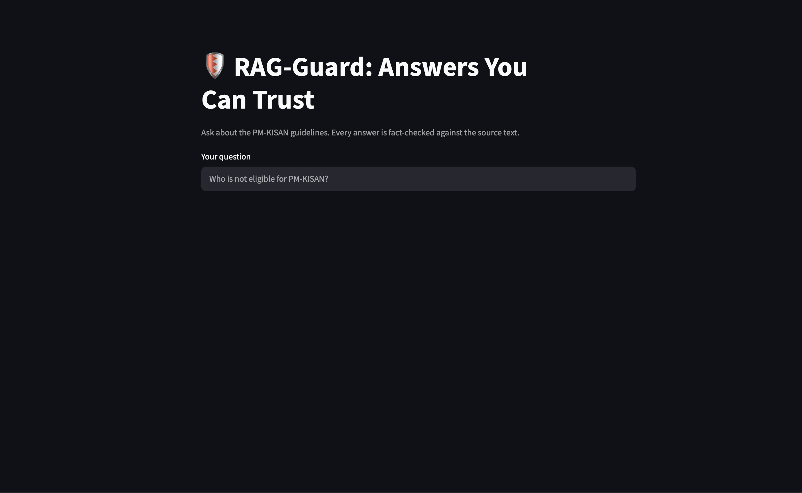

# 🛡️ RAG-Guard: Government Scheme Q&A with Hallucination Detection

A document question-answering system that doesn't just answer, it **fact-checks its own answers**. Every response is broken into individual claims, and each claim is verified against the retrieved source text. Answers with unsupported claims are flagged as unreliable.

Built on the official **PM-KISAN Operational Guidelines** so citizens can get accurate scheme information, with a warning when the AI is guessing.

> **Live demo:** _add your Streamlit / Hugging Face Spaces link here_



---

## Why this project?

Large language models sometimes produce confident but false answers ("hallucinations"). For government schemes, a wrong answer about eligibility or benefit amounts can cause real harm, such as someone missing a benefit they qualify for. RAG-Guard adds a verification layer so users can see **which parts of an answer are backed by the source and which are not**.

## How it works

```
PDF → chunk → embed → ChromaDB
Question → retrieve top-4 chunks → LLM answers using ONLY those chunks
Answer + chunks → claim-by-claim checker (second LLM) → faithfulness score → ✅ / ⚠️
```

1. **Ingestion (`ingest.py`)**: loads PDFs, splits them into 800-character chunks (100 overlap), embeds them with `all-MiniLM-L6-v2`, and stores them in ChromaDB.
2. **Answering (`rag.py`)**: retrieves the 4 most similar chunks and asks the LLM to answer using only that context, or say "I don't know based on the documents."
3. **Verification (`judge.py`)**: a *different* LLM splits the answer into atomic claims and marks each as supported or unsupported by the context.
   **Faithfulness score = supported claims ÷ total claims.** Scores below 0.8 are flagged.
4. **Interface (`app.py`)**: a Streamlit app showing the answer, the score, claim-by-claim evidence, and the source chunks.

### Design choices

- **Separate generator and judge models.** Answers come from `openai/gpt-oss-120b`; verification uses `openai/gpt-oss-20b`. A model grading its own output tends to agree with itself, so a different judge reduces that bias.
- **Claim-level checking instead of a vague "is this good?" score.** Splitting into claims makes failures specific and explainable.
- **Refusals aren't penalized.** "I don't know based on the documents" is correct behavior, so it isn't flagged.
- **Retries on malformed JSON.** The judge retries if the LLM returns invalid output.

## Example

**Deliberately wrong answer tested against the detector:**

> "Farmers get Rs. 6000 per year, and those who file late are fined Rs. 500."

| Claim | Supported? |
|---|---|
| Farmers get Rs. 6000 per year | ✅ Yes (found in source) |
| Those who file late are fined Rs. 500 | ❌ No (not in source) |

**Faithfulness score: 0.5 → flagged as unreliable.** The genuine answer to the same question scored 1.0.

## Results

> _Fill these in after running your evaluation. Replace every `TBD` with your real numbers._

| Metric | Value |
|---|---|
| Test questions | TBD |
| Answerable / unanswerable questions | TBD / TBD |
| RAGAS faithfulness | TBD |
| RAGAS answer relevancy | TBD |
| RAGAS context precision | TBD |
| RAGAS context recall | TBD |
| Hallucination detector precision | TBD |
| Hallucination detector recall | TBD |

### Experiments

| Experiment | Faithfulness | Context recall | Notes |
|---|---|---|---|
| Baseline (chunk 800, k=4) | TBD | TBD | |
| Chunk size 400 | TBD | TBD | |
| Chunk size 1200 | TBD | TBD | |
| k = 2 | TBD | TBD | |
| k = 6 | TBD | TBD | |

## Tech stack

Python · LangChain · ChromaDB · Sentence-Transformers (`all-MiniLM-L6-v2`) · Groq API (`openai/gpt-oss-120b`, `openai/gpt-oss-20b`) · Streamlit · RAGAS

## Project structure

```
rag-guard/
├── data/            # source PDFs (not included, see Data section)
├── ingest.py        # load, chunk, embed, store
├── rag.py           # retrieval + answer generation
├── judge.py         # claim-level hallucination detector
├── app.py           # Streamlit interface
├── evaluate.py      # RAGAS evaluation (optional)
├── requirements.txt
└── README.md
```

## Getting started

**1. Clone and set up**
```bash
git clone https://github.com/<your-username>/rag-guard.git
cd rag-guard
python -m venv venv
source venv/bin/activate        # Windows: venv\Scripts\activate
pip install -r requirements.txt
```

**2. Add your Groq API key**

Get a free key at [console.groq.com](https://console.groq.com), then create a `.env` file:
```
GROQ_API_KEY=your_key_here
```
Never commit this file. It is listed in `.gitignore`.

**3. Add the data**

Download the [PM-KISAN Operational Guidelines](https://pmkisan.gov.in/Documents/RevisedPM-KISANOperationalGuidelines(English).pdf) and place it in the `data/` folder.

**4. Build the index and run**
```bash
python ingest.py
python -m streamlit run app.py
```

> Groq's available models change over time. If you get a `model_not_found` error, update the model names in `rag.py` and `judge.py` using the current list at [console.groq.com/docs/models](https://console.groq.com/docs/models).

## Data

- **Source:** PM-KISAN Scheme Operational Guidelines (revised as on 29.03.2020), Ministry of Agriculture & Farmers' Welfare, Government of India.
- **Size:** 12 pages, indexed as 45 chunks.
- The PDF is a public government document. It is not redistributed in this repo, so download it from the official link above.

## Limitations

- **Diagrams and images are not indexed.** Only the PDF text layer is used, so information that appears only in a figure is invisible to the system.
- **The judge is also an LLM.** It can be wrong, and a claim can be marked supported or unsupported incorrectly. The detector reduces hallucination risk but doesn't eliminate it.
- **Single, dated source.** The guidelines are from 2020, and scheme rules may have changed since. Answers reflect only this document.
- **Not official advice.** This is a portfolio project. Always confirm eligibility and benefits on the official PM-KISAN portal.

## Future work

- Add more documents (Ayushman Bharat, RTI Act, Tamil Nadu schemes) and multilingual (Tamil) support
- Hybrid search (BM25 + embeddings) and a reranker
- OCR / vision model to index diagrams
- Log queries and scores to a dashboard, and add an "answer only if confidence is high" mode

## Author

**Charles** · AI & Data Science graduate
_Add your LinkedIn / email here_

## License

MIT
